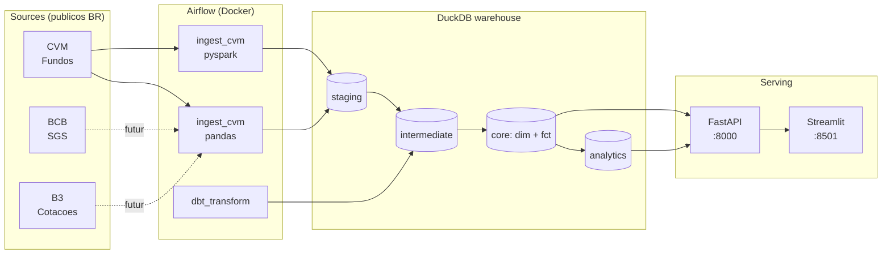

<div align="center">

# finbr-data-platform

**End-to-end data platform · 100% free-tier · dados públicos brasileiros**

Airflow · dbt · DuckDB · FastAPI · Streamlit · PySpark · pytest data quality

[](https://github.com/nicolaskra/finbr-data-platform/actions/workflows/ci.yml)
[](https://www.python.org/downloads/)
[](https://airflow.apache.org/)
[](https://github.com/duckdb/dbt-duckdb)
[](https://duckdb.org/)
[](https://fastapi.tiangolo.com/)
[](https://streamlit.io/)
[](LICENSE)
[](./CONSTRAINTS.md)

</div>

---

## 🎯 Por que esse projeto existe

A maioria dos portfolios Data Engineering replica tutoriais: NYC Taxi, MNIST, GitHub events.
Esse projeto faz o oposto: usa **dados reais públicos do mercado financeiro brasileiro**
(CVM, BCB, B3) e implementa **end-to-end completo** demonstrando:

- **System integration:** ingestão → orquestração → warehouse → transformação → API → frontend
- **Sinais sênior:** trade-offs documentados (5 ADRs), failure handling, idempotência,
  data quality tests informados pelo dado real
- **Hobby-driven:** dado público BR + matemática financeira (rentabilidade composta)
- **Constraint inegociável:** **100% gratuito** (ver [`CONSTRAINTS.md`](./CONSTRAINTS.md))

> *"Senior portfolio mostra POR QUE existe, não só COMO funciona."* — The Data Forge

---

## 🏗️ Arquitetura



---

## 📊 Stack

| Camada | Tool | Por quê (vs alternativa popular) |
|---|---|---|
| Orquestração | **Apache Airflow** | Padrão de mercado, DAGs versionados, retry nativo |
| Ingestão | **pandas + pyarrow** | Dataset 14 MB → Spark seria overhead (ver [ADR 005](./docs/decisions/005-pandas-vs-pyspark.md)) |
| Ingestão distribuída | **PySpark** (versão didática) | Demonstra fluência; manual trigger apenas |
| Warehouse | **DuckDB** | Performance Snowflake-like, single-file, free ([ADR 002](./docs/decisions/002-why-duckdb.md)) |
| Transformação | **dbt-duckdb** | Lineage + tests + docs autogerados ([ADR 003](./docs/decisions/003-why-dbt-core.md)) |
| API | **FastAPI + Pydantic** | Async, type-safe, OpenAPI grátis |
| Dashboard | **Streamlit** | Deploy free, prototipagem rápida |
| Container | **Docker Compose** | `git clone && docker compose up` |
| CI | **GitHub Actions** | Free 2000 min/mês |
| Quality | **pytest + dbt tests** | 3 camadas: unit (DAG/API) + business rules + dbt |

**Ver decisões em** [`docs/decisions/`](./docs/decisions/) (5 ADRs)

---

## 🚀 Rodar local (5 min)

```bash
git clone https://github.com/nicolaskra/finbr-data-platform.git
cd finbr-data-platform

# Sobe Airflow + API + Dashboard (3 containers)
docker compose up -d

# Aguarda ~3 min na primeira vez (download imagens + build)
# Acompanhe: docker compose ps
```

### Endpoints

| Serviço | URL | Login |
|---|---|---|
| Airflow | http://localhost:8080 | `admin` / senha em `airflow/standalone_admin_password.txt` |
| API docs | http://localhost:8000/docs | — |
| Dashboard | http://localhost:8501 | — |

### Primeiro pipeline run

```bash
# Despausar e disparar a DAG de ingest
docker exec finbr-airflow airflow dags unpause ingest_cvm_informe_diario
docker exec finbr-airflow airflow dags trigger ingest_cvm_informe_diario

# Aguardar concluir, depois rodar dbt
docker exec finbr-airflow airflow dags unpause dbt_transform
docker exec finbr-airflow airflow dags trigger dbt_transform

# Verificar warehouse
curl http://localhost:8000/health
```

---

## 📊 Dados produzidos (último run real, Abr/2026)

| Camada | Tabela | Linhas |
|---|---|---|
| Staging | `stg_cvm__informe_diario` | 506.122 |
| Core | `dim_fundo_classe` | 25.674 |
| Core | `fct_fundo_rentabilidade_mensal` | 25.598 |
| Analytics | `top_fundos_rentabilidade_mes` | 50 |

**Pipeline completo (pandas):** ~4s  ·  **PySpark equivalente:** ~10s (cold JVM)

---

## ✅ Testes (34/34 em 3.4s)

| Categoria | Qtd | Cobertura |
|---|---|---|
| `tests/dags/` | 10 | Estrutura DAG + lógica das tasks (pytest + DagBag) |
| `tests/api/` | 10 | TestClient + DuckDB sintético em fixture |
| `tests/data_quality/` | 14 | Asserções de regra de negócio sobre warehouse real |
| `dbt build` | 22 | not_null, unique, relationships, custom |

**Rodar tudo:**
```bash
pytest tests/ -v
docker exec finbr-airflow bash -c "cd /opt/airflow/dbt && dbt build --profiles-dir ."
```

---

## 🔍 Achados reais documentados

Toda anomalia descoberta nos data quality tests vira aprendizado documentado:

- **CVM Resolução 175/2024:** schema mudou (`TP_FUNDO` → `TP_FUNDO_CLASSE`); fail-fast pegou
- **PL negativo:** 0.001% das linhas (fundos em liquidação / alavancados) — threshold informado pelo dado
- **Outlier 1360%:** classe pequena com NAV distorcido — filtros atuais não cortam

**Ver** [`docs/data_quality_findings.md`](./docs/data_quality_findings.md)

---

## 🗂️ Estrutura

```
finbr-data-platform/
├── airflow/
│   ├── dags/
│   │   ├── ingest_cvm_informe_diario.py        # pandas (default)
│   │   ├── ingest_cvm_informe_diario_spark.py  # PySpark (didático)
│   │   └── dbt_transform.py                    # orquestra dbt
│   ├── Dockerfile                              # + Java 17 + dbt + pyspark
│   └── requirements.txt
├── dbt/
│   ├── dbt_project.yml
│   ├── profiles.yml
│   ├── macros/read_raw_parquet.sql
│   └── models/
│       ├── staging/cvm/
│       ├── intermediate/
│       └── marts/{core,analytics}/
├── app/
│   ├── api/                                    # FastAPI
│   │   ├── routers/{health,fundos,analytics}.py
│   │   ├── schemas.py
│   │   └── Dockerfile
│   └── dashboard/                              # Streamlit
│       ├── streamlit_app.py
│       └── Dockerfile
├── tests/
│   ├── dags/                                   # 10 tests
│   ├── api/                                    # 10 tests
│   └── data_quality/                           # 14 tests
├── docs/
│   ├── architecture.md
│   ├── data_quality_findings.md
│   └── decisions/                              # 5 ADRs
├── .github/workflows/ci.yml                    # GitHub Actions
├── .pre-commit-config.yaml                     # ruff + sqlfluff
├── CONSTRAINTS.md                              # regras inegociáveis
├── docker-compose.yml
├── pyproject.toml
└── README.md
```

---

## 📚 Sources

- **CVM:** [Dados Abertos — Informes Diários FI](https://dados.cvm.gov.br/dataset/fi-doc-inf_diario)
- **BCB:** [SGS — Sistema Gerenciador de Séries Temporais](https://www3.bcb.gov.br/sgspub/) *(roadmap)*
- **B3:** [Histórico de cotações](https://www.b3.com.br/) *(roadmap)*

---

## 🛣️ Roadmap

- [x] **S1** — Airflow + DAG ingest CVM (pandas) + tests + ADRs
- [x] **S2** — dbt warehouse DuckDB (6 models, 16 tests, 2 exposures)
- [x] **S3** — FastAPI (3 endpoints) + Streamlit dashboard + paridade PySpark
- [x] **S4** — Data quality tests + CI + pre-commit + público
- [ ] **S5** — Ingest BCB SGS (Selic, IPCA) + BCB no warehouse + dashboard timeline
- [ ] **S6** — Ingest B3 cotações históricas (versão PySpark vira default)
- [ ] **S7** — Evals com Ollama local (Llama 3.1) — opcional

---

## 📄 License

MIT — ver [LICENSE](./LICENSE)

---

<div align="center">

Construído por [Nícolas Klein](https://github.com/nicolaskra) · [LinkedIn](https://www.linkedin.com/in/nicolaskleincg/) · [smartbusiness.ia.br](https://smartbusiness.ia.br/)

</div>
