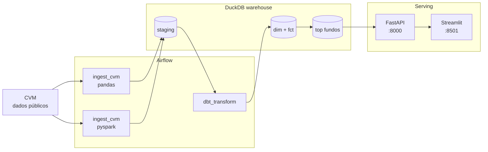

<div align="center">

# finbr-data-platform

**Plataforma de dados end-to-end sobre fundos de investimento brasileiros (CVM)**

[](https://finbr-data-platform-fmwlw5fpfhdduskgn8zlrt.streamlit.app/)
[](https://github.com/nicolaskra/finbr-data-platform/actions/workflows/ci.yml)
[](#-testes-3434-passando)
[](./CONSTRAINTS.md)
[](https://www.python.org/downloads/)
[](LICENSE)

`Airflow` · `dbt` · `DuckDB` · `FastAPI` · `Streamlit` · `PySpark` · `pytest`

</div>

---

## 🎯 TL;DR

Em **um sábado de trabalho**, um pipeline real:

1. **Baixa** o Informe Diário de Fundos da CVM (~14 MB/mês, dado público real)
2. **Valida schema** e particiona em Parquet (`data/raw/cvm/YYYY-MM/`)
3. **Transforma** via dbt em warehouse DuckDB (staging → marts dimensional)
4. **Serve** via FastAPI 3 endpoints + dashboard Streamlit
5. **Valida** com 34 testes (estrutura DAG, API, regras de negócio sobre dado real)

**Resultado de um run real:** 506 mil linhas processadas, 25 mil classes de fundo, top 50 por rentabilidade mensal — tudo em **~4 segundos** end-to-end.

---

## 🚀 Como rodar (5 minutos)

### Demo público (sem instalar nada)

👉 **https://finbr-data-platform-fmwlw5fpfhdduskgn8zlrt.streamlit.app/** — dashboard rodando no Streamlit Cloud, modo `duckdb` (lê o warehouse commitado direto, sem API). Deploy documentado em [`docs/deploy_streamlit_cloud.md`](./docs/deploy_streamlit_cloud.md).

### Stack completa local (Airflow + API + Dashboard)

```bash
git clone https://github.com/nicolaskra/finbr-data-platform.git
cd finbr-data-platform
docker compose up -d            # sobe 3 containers: airflow + api + dashboard
```

**Endpoints prontos:**
| Serviço | URL | Senha |
|---|---|---|
| Airflow | http://localhost:8080 | admin / `cat airflow/standalone_admin_password.txt` |
| API + docs | http://localhost:8000/docs | — |
| Dashboard | http://localhost:8501 | — |

**Disparar pipeline real:**
```bash
docker exec finbr-airflow airflow dags unpause ingest_cvm_informe_diario
docker exec finbr-airflow airflow dags trigger ingest_cvm_informe_diario
# aguarde ~10s, depois:
docker exec finbr-airflow airflow dags unpause dbt_transform
docker exec finbr-airflow airflow dags trigger dbt_transform
curl http://localhost:8000/health
```

---

## 🏗️ Arquitetura



---

## 📊 Stack — por que cada escolha

| Camada | Tool | Decisão |
|---|---|---|
| Orquestração | **Airflow** | Padrão de mercado · DAGs versionadas · [ADR 001](./docs/decisions/001-why-airflow-standalone.md) |
| Ingestão | **pandas** (default) + **PySpark** (paralela) | 14 MB ⇒ Spark seria overhead · [ADR 005](./docs/decisions/005-pandas-vs-pyspark.md) |
| Warehouse | **DuckDB** | Performance Snowflake-like · single-file · zero custo · [ADR 002](./docs/decisions/002-why-duckdb.md) |
| Transformação | **dbt-duckdb** | Lineage + tests + docs autogerados · [ADR 003](./docs/decisions/003-why-dbt-core.md) |
| API | **FastAPI + Pydantic** | Async · type-safe · OpenAPI grátis |
| Dashboard | **Streamlit** | Dois modos: `api` (Docker local, consome FastAPI) ou `duckdb` (standalone, le warehouse direto — usado no Streamlit Cloud) · deploy free |
| CI | **GitHub Actions** | 2.000 min/mês free |
| Quality | **pytest + dbt tests** | 3 camadas: unit · business rules · data |

📌 **Constraint inegociável:** 100% gratuito, sem APIs LLM pagas, sem warehouse pago — ver [CONSTRAINTS.md](./CONSTRAINTS.md)

---

## 🔍 Achados reais documentados

Cada anomalia descoberta pelos data quality tests vira aprendizado em [`docs/data_quality_findings.md`](./docs/data_quality_findings.md):

| # | Achado | Como pegamos | Decisão |
|---|---|---|---|
| 1 | **PL negativo** em 0.001% das linhas | Test `test_vl_patrim_liq` quebrou | Threshold informado: fundos em liquidação / alavancados |
| 2 | **Schema CVM mudou** (Res. 175/2024) | Fail-fast da DAG (`raise ValueError`) | EXPECTED_COLUMNS atualizado |
| 3 | **Outlier 1360%** no top fundos | Smoke test do dashboard | ✅ Filtro `nr_cotistas >= 5` aplicado |

> **Sinal sênior:** thresholds informados por **conhecimento do dado**, não absolutos.

---

## ✅ Testes (34/34 passando)

| Categoria | Qtd | Stack |
|---|---|---|
| `tests/dags/` | 10 | pytest + Airflow DagBag |
| `tests/api/` | 10 | TestClient + DuckDB sintético |
| `tests/data_quality/` | 14 | Asserções sobre warehouse REAL (skipped se vazio) |
| `dbt build` | 22 | not_null · unique · relationships · custom |

```bash
pytest tests/ -v                                          # 34 passed em 3.43s
docker exec finbr-airflow bash -c "cd /opt/airflow/dbt && dbt build --profiles-dir ."
```

---

## 📦 Volumes reais (último run, 12 meses backfill)

```
Raw parquets:  6,3M linhas em 12 partições mensais (2025-05 → 2026-04)
Dim:          28.557 classes de fundo únicas
Fato:        305.164 linhas (rentabilidade mensal por classe × 12 meses)
Analytics:       600 (top 50 fundos × 12 meses, filtros PL/dias úteis/cotistas)
Warehouse:    30.0 MB (DuckDB file commitado pro deploy Streamlit Cloud)

Pipeline pandas:  ~4 segundos por mês
Backfill 12 meses + rebuild warehouse: ~30 segundos end-to-end
```

> **Backfill manual:** `python scripts/backfill_cvm.py 2025-05 2026-04`
> **Rebuild warehouse:** `python scripts/rebuild_warehouse.py` (replica dbt sem o CLI, evita bug de encoding no Windows)

---

## 🛣️ Roadmap

- [x] **S1** · Airflow + DAG ingest CVM + 10 tests + 3 ADRs
- [x] **S2** · dbt warehouse DuckDB · 6 models · 16 tests · 2 exposures
- [x] **S3** · FastAPI + Streamlit + paridade PySpark
- [x] **S4** · Data quality tests · CI · pre-commit · público
- [x] **S4.5** · Dashboard redesign v2 (3 páginas, plotly, benchmark CDI hardcoded)
- [ ] **S5** · Ingest BCB SGS (Selic, IPCA) · substitui CDI hardcoded por lookup real
- [ ] **S6** · Ingest B3 cotações (PySpark vira default)
- [ ] **S7** · Evals com Ollama local (Llama 3.1) — opcional

---

<div align="center">

📌 **Estrutura:** [`docs/architecture.md`](./docs/architecture.md) · **Decisões:** [`docs/decisions/`](./docs/decisions/) · **Achados:** [`docs/data_quality_findings.md`](./docs/data_quality_findings.md)

Construído por [Nícolas Klein](https://github.com/nicolaskra) · [LinkedIn](https://www.linkedin.com/in/nicolaskleincg/)

</div>
