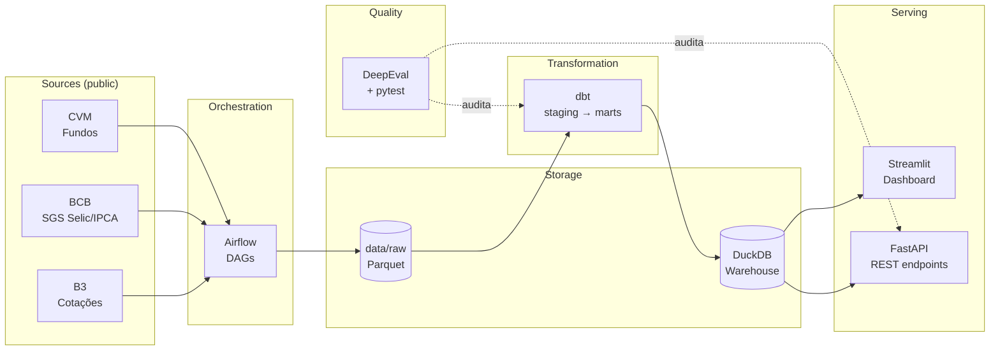

<div align="center">

# finbr-data-platform

**End-to-end data platform on Brazilian public financial data**

Airflow · dbt · DuckDB · FastAPI · Streamlit · DeepEval

[](https://www.python.org/downloads/)
[](https://airflow.apache.org/)
[](https://github.com/duckdb/dbt-duckdb)
[](LICENSE)
[]()

</div>

---

## 🎯 Por que esse projeto existe

A maioria dos projetos de portfolio de Data Engineering replica tutoriais — NYC Taxi, MNIST, GitHub events. Esse projeto faz o oposto: usa **dados reais públicos do mercado financeiro brasileiro** (CVM, BCB, B3) pra demonstrar:

- **System integration end-to-end:** ingestão → orquestração → transformação → warehouse → API → frontend → evals
- **Senior signals:** trade-offs documentados, failure handling, idempotência, replay, cost analysis
- **Hobby-driven:** dado público BR, não dataset de tutorial
- **Custo zero:** stack 100% local/free tier (DuckDB ao invés de Snowflake, Airflow standalone, sem cloud paga)

> Inspirado pelo princípio do The Data Forge:
> *"Senior portfolio mostra POR QUE existe, não só COMO funciona."*

---

## 🏗️ Arquitetura



---

## 📦 Stack

| Camada | Tool | Por quê |
|---|---|---|
| Orquestração | Airflow 2.x (standalone) | Padrão de mercado, DAGs versionados, retry/SLA nativos |
| Ingestão | Python + `requests` + `pyarrow` | Sem framework pesado pra fontes HTTP simples |
| Storage raw | Parquet particionado | Colunnar, comprimido, lê com qualquer engine |
| Warehouse | DuckDB | Performance Snowflake-like, zero custo, single-file |
| Transformation | dbt-duckdb | Lineage, tests, docs autogerados |
| API | FastAPI + Pydantic | Async, type-safe, OpenAPI grátis |
| Frontend | Streamlit | Dashboard rápido, deploy free |
| Quality | DeepEval + pytest | Eval de LLM + testes determinísticos |
| Container | Docker Compose | "git clone && docker compose up" |

**Ver decisões detalhadas:** [`docs/decisions/`](./docs/decisions/)

---

## 🗂️ Estrutura do repo

```
finbr-data-platform/
├── airflow/
│   ├── dags/              # DAGs Python
│   ├── plugins/
│   └── requirements.txt
├── dbt/                   # models, tests, macros (próxima sessão)
├── data/
│   ├── raw/               # Parquet particionado por fonte/YYYY-MM
│   └── staging/
├── tests/                 # pytest (unit + DAG validation)
├── docs/
│   ├── architecture.md
│   └── decisions/         # ADRs (Architecture Decision Records)
├── docker-compose.yml     # Airflow standalone
├── pyproject.toml
└── README.md
```

---

## 🚀 Setup (em construção)

```bash
git clone https://github.com/nicolaskra/finbr-data-platform.git
cd finbr-data-platform
docker compose up -d                    # Airflow em http://localhost:8080
# admin/admin password gerado em airflow/standalone_admin_password.txt
```

---

## 🗓️ Status & roadmap

| Sessão | Foco | Status |
|---|---|---|
| 1 | Setup repo, Airflow Docker, 1ª DAG (ingest CVM informe diário) | 🟡 Em andamento |
| 2 | dbt models staging/marts + DuckDB warehouse | ⏳ |
| 3 | FastAPI + Streamlit dashboard | ⏳ |
| 4 | DeepEval + Docker Compose final + público | ⏳ |

---

## 📚 Fontes de dados

- **CVM:** [Dados Abertos CVM — Informes Diários FI](https://dados.cvm.gov.br/dataset/fi-doc-inf_diario)
- **BCB:** [SGS — Sistema Gerenciador de Séries Temporais](https://www3.bcb.gov.br/sgspub/)
- **B3:** [Histórico de cotações](https://www.b3.com.br/pt_br/market-data-e-indices/servicos-de-dados/market-data/historico/mercado-a-vista/series-historicas/)

---

## 📄 License

MIT — ver [LICENSE](./LICENSE)

---

<div align="center">

Construído por [Nícolas Klein](https://github.com/nicolaskra) — projeto de portfolio Data Engineering 2026

</div>
