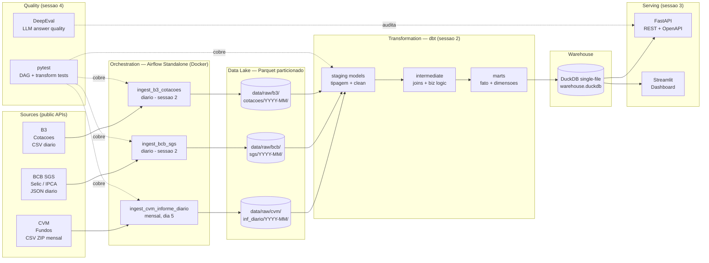

# Arquitetura — finbr-data-platform

## Visão de alto nível

---

## Decisões arquiteturais (ADRs)

- [001 — Why Airflow Standalone (no Postgres/Celery)](./decisions/001-why-airflow-standalone.md)
- [002 — Why DuckDB (no Snowflake/BigQuery)](./decisions/002-why-duckdb.md)
- [003 — Why dbt-core (no Fivetran/Stitch)](./decisions/003-why-dbt-core.md)

---

## Particionamento de dados raw

Padrão: `data/raw/{source}/{dataset}/{YYYY-MM}/{file}.parquet`

Exemplo: `data/raw/cvm/inf_diario/2026-04/inf_diario.parquet`

**Por que YYYY-MM em vez de YYYY/MM/DD?**
- CVM publica dado mensal (não diário)
- BCB SGS pode ser agregado mensal mesmo sendo diário
- Simplifica navegação e dbt sources
- Compatível com Hive-style partitioning (DuckDB lê com `partition_by`)

---

## Idempotência

Toda DAG aqui é **idempotente**: re-rodar pra mesma partição substitui o output (não duplica).

- Download CVM é determinístico (mesma URL → mesmo conteúdo)
- `salvar_particionado` faz `rename` (substitui)
- dbt models são `table` ou `incremental` com `unique_key` (sessão 2)

---

## Failure handling

Cada task tem:
- `retries=3` com `retry_exponential_backoff=True`
- `retry_delay=5min` inicial
- Validação de schema explícita (raise se schema CVM mudar — fail-fast)
- Logs estruturados em `airflow/logs/`

DLQ não implementado nesta sessão (Standalone executor não suporta). Em produção: Celery + Redis + DLQ via failure callback.
